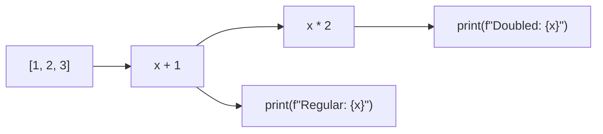
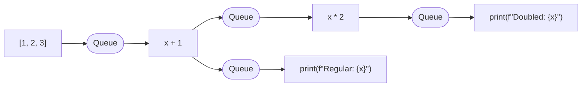

# Execution

Executing a [Graph](../components/graph.md) can be done by calling `run(graph)`.

As an example, let's look at what happens when executing the following graph.

```python
from asyncgraphs import Graph, run

g = Graph()
transformed = g | [1, 2, 3] | (lambda x: x + 1)
transformed | (lambda x: x * 2) | (lambda x: print(f"Doubled: {x}"))
transformed | (lambda x: print(f"Regular: {x}"))

await run(g)
```

The graph thus looks like this:



When calling `run(g)`, this library adds [asyncio Queues](https://docs.python.org/3/library/asyncio-queue.html) between each pair of nodes.
At runtime, this is the graph:



## Concurrency

### Inter-node concurrency

There is concurrency between nodes. 
When the execution of 1 node is blocked by I/O, other nodes get to process their input events.

### Intra-node concurrency

Currently, intra-node concurrency (a.k.a processing handling multiple events in 1 node concurrently) is not supported.

This will be implemented in [this ticket](https://github.com/SamVermeulen42/asyncgraphs/issues/4).