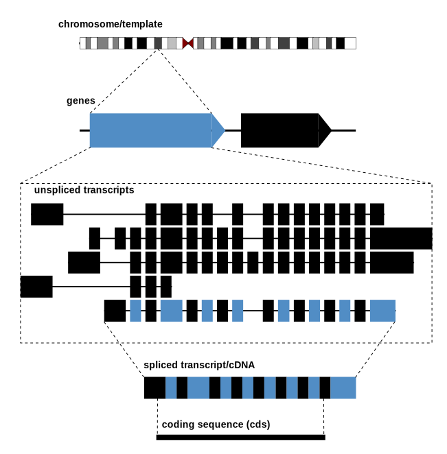
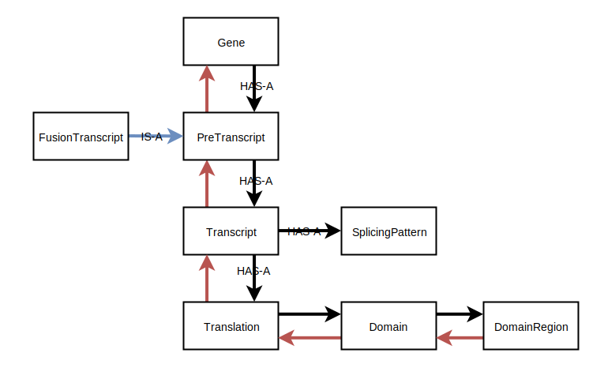

# Sub-package Documentation

## Types of Output Files

| expected name/suffix           | file type/format                  | content                                  |
| ------------------------------ | --------------------------------- | ---------------------------------------- |
| ``annotations.tab``            | text/tabbed                       | annotated events                         |
| ``annotations.fusion-cdna.fa`` | [fasta](../../../glossary/#fasta) | putative fusion unspliced cDNA sequences |
| ``drawings/*.svg``             | [SVG](../../../glossary/#svg)     | diagrams                                 |
| ``drawings/*.legend.json``     | [JSON](../../../glossary/#json)   | diagram legend/metadata                  |

## Algorithm Overview

see [annotating events](../../../background/theory/#annotating-events)

- read in breakpoint pairs
- generate strand-specific annotations (one annotation per strand, multiple if multiple genes/transcripts in the region)
- try building fusion transcripts for bp-specific calls
- generate [SVG](../../../glossary/#svg) diagrams

## Levels of Annotations

## Overview of Class Relationships

The Annotation sub-package has objects for genetic annotations and related calculations. The basic layout of the
package is shown above. IS-A relationships are given by the blue arrows. HAS-A relationships are shown in black.
And reference_object/parent
type relationships are shown in red. mavis.annotate.genomic.Gene is a gene. Start and end are
genomic positions wrt to the template/chr. mavis.annotate.genomic.PreTranscript is the
unspliced transcript. Start and end are genomic positions wrt to the template/chr.
mavis.annotate.genomic.Transcript: is the spliced transcript. Start and end coordinates are
1 to the length of the spliced product in base pairs.
mavis.annotate.protein.Translation: is the translation of the spliced transcript. Start and
end are cdna positions wrt the 5' end of the spliced transcript. The start and end here describe the start and end
of the coding sequence
