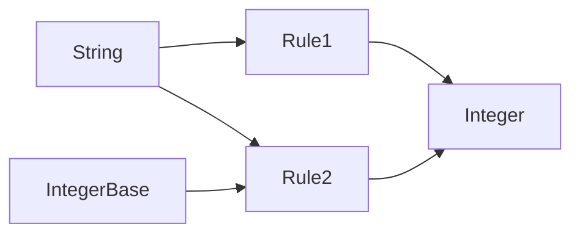
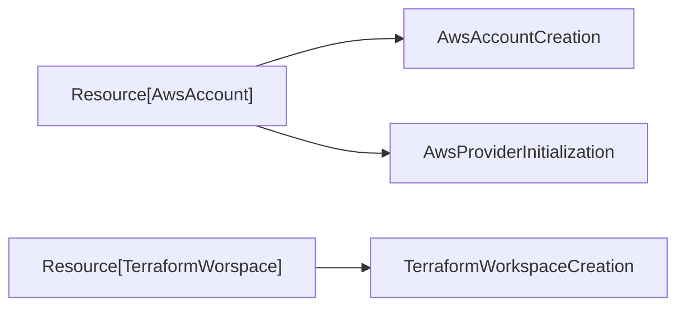

# adjudicator

> __Adjudicator__ _(nount_): An adjudicator is a person or body that makes formal judgments on a disputed matter. They
> are the ones who settle disputes or decide who is right in a disagreement. This could be a judge in a courtroom, an
> arbitrator in a negotiation, or any person or system given the power to make decisions of this type.

Adjudicator is a framework for type-based rules engines largely inspired by the Pants build system. The rule graph
consists of nodes which are concrete Python types and edges which are functions that take a set of input types and
produce an output type.

Rules are matched on a set of facts, which populate the possible input types of a rule. Deriving a type may require
chained execution of rules, which is supported. Global facts may be used to populate a potential input type for all
rule executions.

In a way, Adjudicator can also be called a dependency injection engine.



In the above example, an `Integer` can be derived by providing a `String` as a fact and `Rule1` will be executed, or
by also providing an `IntegerBase` and `Rule2` will be executed.

__Installation__

Adjudicator is available on PyPI. You need at least Python 3.10.

```bash
pip install python-adjudicator
```

__Example code__

Check out the [examples/codegen/](examples/codegen/) directory for a simple example of a rules engine that generates
Terraform code based on a set of Kubernetes-like resources. This example combines the resource management API with
the rules engine API.



The advantage of using a rules engine here is that it avoids executing the same rule again if it was already executed
with the same inputs. It also makes it easier to increase the system's complexity by adding more rules without also
significantly increasing the complexity of the code.

__Future extensions__

* Currently the rule graph stores rules as connections between types and rules on edges. A more efficient
  representation would be the one illustrated above, where types are connected to rules which are connected to types.
* The ability to mark facts as required to be consumed. If such a fact is not consumed during the execution of a
  request, an error will be raised.
